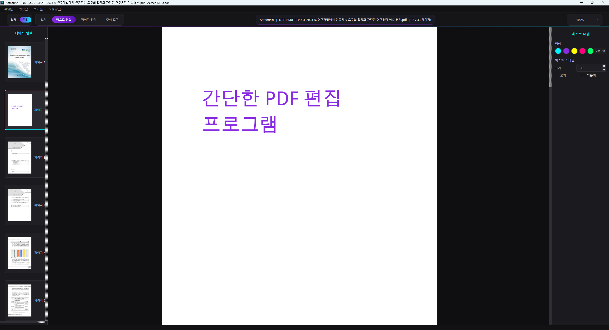

# AetherPDF

AetherPDF는 Windows에서 바로 실행할 수 있는 오프라인 데스크톱 PDF 편집기입니다. PySide6 기반의 네이티브 UI와 PyMuPDF 렌더링/편집 엔진을 사용해 PDF 열람, 페이지 관리, 텍스트 편집, 주석 추가를 한 화면에서 처리합니다.



## 주요 기능

- PDF 문서 열기, 저장, 다른 이름으로 저장
- 페이지 썸네일 탐색 및 페이지 이동
- 페이지 회전, 삭제, 빈 페이지 삽입, PDF 병합
- 페이지 관리 모드에서 드래그 앤 드롭으로 페이지 순서 변경
- 기존 텍스트 수정 및 빈 공간에 새 텍스트 추가
- 텍스트 색상, 크기, 굵게, 기울임 스타일 적용
- 형광펜, 밑줄, 취소선, 자유 그리기 주석 도구
- 확대/축소, 너비 맞춤, 현재 배율 표시

## 기술 스택

- **Language**: Python 3.11
- **GUI**: PySide6 / Qt 6
- **PDF Engine**: PyMuPDF (`fitz`)
- **Testing**: pytest, pytest-qt
- **Packaging**: PyInstaller one-file Windows executable

## 실행 방법

### 배포 실행 파일 사용

별도 설치 없이 아래 실행 파일을 실행합니다.

```powershell
.\dist\AetherPDF.exe
```

### 개발 환경에서 실행

```powershell
python -m venv .venv
.\.venv\Scripts\Activate.ps1
pip install -r requirements.txt
python main.py
```

## 사용법

1. **PDF 열기**
   - 상단의 `열기` 버튼 또는 `Ctrl+O`로 PDF 파일을 엽니다.
   - 왼쪽 사이드바에서 페이지 썸네일을 선택해 이동합니다.

2. **확대/축소**
   - 오른쪽 상단의 `+`, `-`, 배율 콤보박스를 사용합니다.
   - 마우스 휠과 `Ctrl` 조합으로도 확대/축소할 수 있습니다.
   - 현재 배율은 오른쪽 상단 퍼센트 표시로 동기화됩니다.

3. **텍스트 편집**
   - `텍스트 편집` 모드로 전환합니다.
   - 기존 텍스트를 클릭하면 인라인 편집창이 표시됩니다.
   - 빈 공간을 클릭하면 새 텍스트를 추가할 수 있습니다.
   - 오른쪽 `텍스트 속성` 패널에서 색상, 크기, 굵게, 기울임을 조정합니다.

4. **페이지 관리**
   - `페이지 관리` 모드로 전환합니다.
   - 왼쪽 썸네일을 드래그해 페이지 순서를 변경합니다.
   - 메뉴에서 페이지 회전, 삭제, 빈 페이지 삽입, PDF 병합을 실행할 수 있습니다.

5. **주석 추가**
   - `주석 도구` 모드로 전환합니다.
   - 오른쪽 `주석 속성` 패널에서 형광펜, 밑줄, 취소선, 자유 그리기를 선택합니다.
   - 색상, 선 두께, 불투명도를 조정한 뒤 문서 영역에 드래그해 주석을 추가합니다.

6. **저장**
   - `저장` 또는 `Ctrl+S`로 현재 PDF에 저장합니다.
   - 원본 파일을 보존하려면 `다른 이름으로 저장`을 사용합니다.

## 빌드 방법

PyInstaller 기반의 Windows 단일 실행 파일을 생성합니다.

```powershell
.\.venv\Scripts\Activate.ps1
python build_app.py
```

빌드 결과물은 아래 경로에 생성됩니다.

```text
dist/AetherPDF.exe
```

## 저장소 구성

```text
main.py                  # 애플리케이션 진입점
views/                   # PySide6 UI 위젯
models/                  # PDF 문서 상태 및 렌더링 모델
services/                # PDF 편집, 저장, 내보내기 로직
config/                  # 설정 및 테마
assets/                  # 애플리케이션 아이콘
tests/                   # pytest 기반 테스트
dist/AetherPDF.exe       # 배포용 Windows 실행 파일
docs/screenshots/        # README용 스크린샷
```

## 테스트

```powershell
pytest
```

GUI 관련 테스트는 `pytest-qt`를 사용합니다. 헤드리스 환경에서는 Qt 플랫폼을 오프스크린으로 지정할 수 있습니다.

```powershell
$env:QT_QPA_PLATFORM = "offscreen"
pytest
```

## 배포 메모

- 배포 대상은 일반적으로 `dist/AetherPDF.exe`, `README.md`, 필요한 문서/스크린샷만 포함합니다.
- `.venv/`, `build/`, 캐시 디렉터리, 임시 PDF, 테스트 산출물은 배포 커밋에 포함하지 않습니다.
